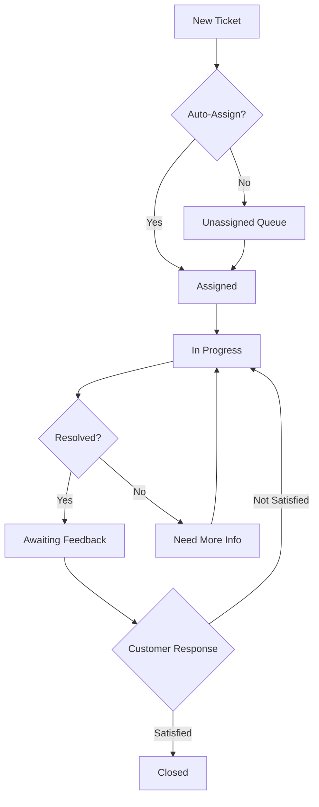
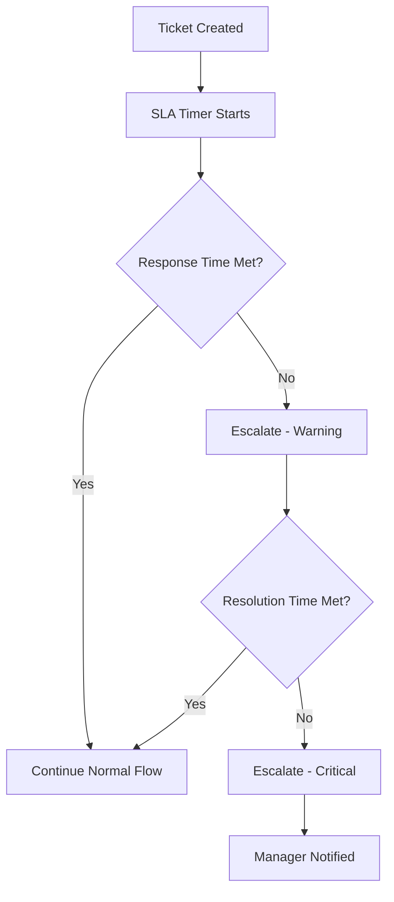

# 🎧 PLATFORM SUPPORT PORTAL
## Complete Specifications - 100% AI-Ready

> **Portal**: Platform Support Portal  
> **Users**: Support Staff, Support Managers, Customer Success Team  
> **Status**: ✅ 100% COMPLETE  
> **Specifications**: 10 Complete Specs  
> **Estimated Time**: 5-6 weeks  

---

## 📋 PORTAL OVERVIEW

The Platform Support Portal is a comprehensive customer support and ticket management system designed for platform support teams to provide exceptional service to all tenants across the SaaS platform.

### Key Capabilities

- **Ticket Management**: Complete ticket lifecycle management
- **Knowledge Base**: Self-service documentation and articles
- **Live Chat**: Real-time support communication
- **Support Analytics**: Performance metrics and SLA tracking
- **Customer Communication**: Email, chat, and notification system
- **Team Management**: Support agent routing and workload management

---

## 📊 SPECIFICATIONS LIST

### Ticket Management System (5 specs)

| Spec ID | Title | Priority | Time |
|---------|-------|----------|------|
| **SPEC-131** | Support Ticket Database Schema | CRITICAL | 2h |
| **SPEC-132** | Ticket Management Dashboard | HIGH | 4h |
| **SPEC-133** | Ticket Details & Resolution | HIGH | 4h |
| **SPEC-134** | Ticket Assignment & Routing | HIGH | 3h |
| **SPEC-135** | Customer Communication System | HIGH | 4h |

### Knowledge Base & Communication (3 specs)

| Spec ID | Title | Priority | Time |
|---------|-------|----------|------|
| **SPEC-136** | Knowledge Base CMS | HIGH | 4h |
| **SPEC-137** | Live Chat System | MEDIUM | 5h |
| **SPEC-138** | Email Templates & Automation | MEDIUM | 3h |

### Analytics & SLA Management (2 specs)

| Spec ID | Title | Priority | Time |
|---------|-------|----------|------|
| **SPEC-139** | Support Analytics Dashboard | HIGH | 4h |
| **SPEC-140** | SLA Tracking & Alerts | HIGH | 3h |

**Total**: 10 specifications, ~36 hours estimated

---

## 🎯 KEY FEATURES

### Ticket Management
```yaml
Features:
  - Multi-channel ticket creation (Email, Chat, Portal, API)
  - Priority-based ticket routing
  - Automatic ticket assignment
  - SLA-based escalation
  - Ticket status workflow
  - Bulk operations
  - Advanced filtering
  - Ticket templates
  - Canned responses
  - Ticket merging & linking
```

### Knowledge Base
```yaml
Features:
  - Article creation & editing
  - Category management
  - Search functionality
  - Version control
  - Public/private articles
  - Multi-language support
  - Rich media support
  - Article analytics
  - Related articles
  - Feedback system
```

### Live Chat
```yaml
Features:
  - Real-time messaging
  - Agent availability status
  - Chat queuing
  - Chat routing
  - Chat history
  - File sharing
  - Typing indicators
  - Read receipts
  - Chat transcripts
  - Quick replies
```

### Support Analytics
```yaml
Metrics:
  - Ticket volume trends
  - Response time averages
  - Resolution time averages
  - First contact resolution rate
  - Customer satisfaction scores
  - Agent performance metrics
  - SLA compliance rate
  - Ticket backlog
  - Channel distribution
  - Common issues analysis
```

---

## 🗄️ DATABASE SCHEMA OVERVIEW

### Core Tables
```sql
-- Support tickets
support_tickets (
  - id, tenant_id, customer_id, subject
  - description, priority, status, category
  - assigned_to, sla_target, first_response_at
  - resolved_at, metadata
)

-- Ticket messages/comments
ticket_messages (
  - id, ticket_id, user_id, message
  - is_internal, attachments, metadata
)

-- Knowledge base articles
kb_articles (
  - id, title, slug, content, category_id
  - is_published, views, helpful_count
  - unhelpful_count, metadata
)

-- Live chat sessions
chat_sessions (
  - id, tenant_id, customer_id, agent_id
  - status, started_at, ended_at, metadata
)

-- Support SLA configurations
support_sla_config (
  - id, priority, first_response_minutes
  - resolution_minutes, escalation_rules
)
```

---

## 🔐 SECURITY & ACCESS CONTROL

### Role Permissions

**Support Agent**
- View assigned tickets
- Update ticket status
- Add comments/notes
- Access knowledge base
- Handle live chats

**Support Manager**
- All agent permissions
- Assign/reassign tickets
- Manage SLA configurations
- Access all analytics
- Manage team members

**Support Admin**
- All manager permissions
- Configure system settings
- Manage knowledge base
- Set up automations
- Access audit logs

---

## 🎨 UI/UX REQUIREMENTS

### Design Standards
- Clean, efficient interface for high-volume ticket handling
- Quick access to common actions
- Keyboard shortcuts for power users
- Split-view for ticket details
- Color-coded priority indicators
- Real-time notifications
- Responsive design (desktop-focused)

### Key Screens
1. **Dashboard**: Ticket overview, metrics, quick actions
2. **Ticket List**: Filterable, sortable ticket queue
3. **Ticket Details**: Full ticket view with action panel
4. **Knowledge Base**: Article browser and editor
5. **Live Chat**: Chat queue and conversation view
6. **Analytics**: Comprehensive support metrics
7. **Settings**: SLA config, templates, automations

---

## 🔄 WORKFLOWS

### Ticket Lifecycle


### SLA Escalation


---

## 📈 PERFORMANCE TARGETS

### Response Times
- Dashboard load: < 1 second
- Ticket list: < 1.5 seconds
- Ticket details: < 1 second
- Search results: < 2 seconds
- Live chat latency: < 200ms

### Capacity
- Support 100,000+ tickets
- Handle 1,000+ concurrent chat sessions
- Process 10,000+ knowledge base articles
- Support 500+ concurrent support agents

---

## 🧪 TESTING REQUIREMENTS

### Test Coverage
- Unit tests: 85%+ coverage
- Integration tests for all workflows
- E2E tests for critical paths
- Load testing for concurrent usage
- Security testing for data isolation

### Key Test Scenarios
- Ticket creation and assignment
- SLA escalation triggers
- Knowledge base search accuracy
- Live chat message delivery
- Multi-tenant data isolation
- Permission enforcement

---

## 🚀 DEPLOYMENT CHECKLIST

- [ ] All database schemas created
- [ ] All API endpoints implemented
- [ ] All UI components built
- [ ] Authentication & authorization configured
- [ ] Real-time features tested
- [ ] Email templates configured
- [ ] SLA rules configured
- [ ] Knowledge base seeded
- [ ] Analytics dashboards verified
- [ ] Performance benchmarks met
- [ ] Security audit completed
- [ ] Documentation complete

---

## 📚 IMPLEMENTATION ORDER

### Week 1: Foundation
1. SPEC-131: Support Ticket Database Schema
2. SPEC-132: Ticket Management Dashboard
3. SPEC-133: Ticket Details & Resolution

### Week 2: Core Features
4. SPEC-134: Ticket Assignment & Routing
5. SPEC-135: Customer Communication System
6. SPEC-136: Knowledge Base CMS

### Week 3: Advanced Features
7. SPEC-137: Live Chat System
8. SPEC-138: Email Templates & Automation

### Week 4: Analytics & Optimization
9. SPEC-139: Support Analytics Dashboard
10. SPEC-140: SLA Tracking & Alerts

---

## 🎓 SUCCESS CRITERIA

✅ **Functionality**
- All ticket operations working smoothly
- Knowledge base fully functional
- Live chat working in real-time
- Analytics displaying accurate data
- SLA alerts triggering correctly

✅ **Performance**
- All pages load within targets
- Real-time features responsive
- Search results accurate and fast
- No memory leaks in long sessions

✅ **Security**
- Multi-tenant isolation verified
- Permission checks working
- Audit logging complete
- Data encryption enabled

✅ **User Experience**
- Intuitive navigation
- Efficient workflows
- Helpful feedback messages
- Responsive design working
- Keyboard shortcuts functional

---

**Ready to Build**: All specifications are complete and AI-ready! 🚀

**Start with**: SPEC-131 (Support Ticket Database Schema)

**Support Contact**: For questions about these specifications, refer to the main project README.
