# 🚀 QUICK START GUIDE
## Build Your Multi-Tenant School Management SaaS with AI Agents

> **🎯 Goal**: Start building TODAY with 100% AI-ready specifications  
> **⏱️ Time**: 30 minutes to first working features  
> **🤖 Approach**: 100% autonomous AI development

---

## 🎊 YOU HAVE EVERYTHING YOU NEED!

This folder contains **360 complete specifications** for building a production-ready Multi-Tenant School Management SaaS platform. Every detail is specified. AI agents can work **completely autonomously**.

---

## 🚀 30-MINUTE QUICK START

### Step 1: Choose Your Starting Point (2 minutes)

**Option A: Start Fresh** (Recommended for new projects)
```bash
Start with Phase 1 - Foundation
Location: PHASE-01-FOUNDATION/
First Spec: SPEC-001-nextjs-initialization.md
```

**Option B: Build Specific Feature** (If you have foundation ready)
```bash
Jump to any phase based on priority
Example: Phase 6 - Teacher Portal
Location: PHASE-06-ACADEMIC-STAFF/
```

---

### Step 2: Read the Phase README (5 minutes)

```bash
# Navigate to your chosen phase
cd COMPLETE-AI-READY-SPECS/PHASE-01-FOUNDATION/

# Open the README.md
# It explains:
# - What you'll build
# - Implementation order
# - Success criteria
# - Timeline estimates
```

**What you'll learn:**
- Phase objectives
- All specifications in the phase
- Implementation order (numbered)
- Completion criteria
- Common pitfalls to avoid

---

### Step 3: Copy First Specification to AI (2 minutes)

**Example: Starting Phase 1**

```bash
# Open the first specification
PHASE-01-FOUNDATION/01-PROJECT-SETUP/SPEC-001-nextjs-initialization.md

# Copy the ENTIRE file content
# Give it to your AI agent with this prompt:
```

**Prompt to AI:**
```
I have a complete specification for initializing a Next.js 15 project.
Please read this specification and implement it exactly as specified.

[PASTE THE ENTIRE SPECIFICATION HERE]

After implementation:
1. Show me what you created
2. Run the test commands specified
3. Verify all success criteria are met
```

---

### Step 4: AI Implements (10 minutes)

**What AI will do autonomously:**
1. ✅ Create project structure
2. ✅ Install dependencies
3. ✅ Configure TypeScript
4. ✅ Setup configuration files
5. ✅ Run tests
6. ✅ Verify everything works

**You do:** Nothing! AI does everything.

---

### Step 5: Verify & Test (5 minutes)

```bash
# AI will run these commands:
npm install
npm run dev
npm run type-check
npm run lint

# You verify:
# ✅ App runs on http://localhost:3000
# ✅ No TypeScript errors
# ✅ No linting errors
```

---

### Step 6: Move to Next Specification (2 minutes)

```bash
# Give AI the next specification
PHASE-01-FOUNDATION/01-PROJECT-SETUP/SPEC-002-typescript-config.md

# Use the same prompt structure:
"Please implement SPEC-002 exactly as specified..."
```

---

### Step 7: Repeat for All Specifications (Ongoing)

**Continue the pattern:**
```
SPEC-001 → SPEC-002 → SPEC-003 → ... → SPEC-360
```

**Each specification builds on the previous one.**

---

## 🎯 FULL IMPLEMENTATION PATHS

### Path 1: Complete Platform (8-12 months with AI)

```mermaid
graph LR
    A[Phase 1: Foundation<br/>4-6 weeks] --> B[Phase 2: UI Components<br/>3-4 weeks]
    B --> C[Phase 3: Platform Portals<br/>3-4 weeks]
    C --> D[Phase 4: Tenant Portals<br/>4-5 weeks]
    D --> E[Phase 5: Branch Leadership<br/>3-4 weeks]
    E --> F[Phase 6: Academic Staff<br/>4-5 weeks]
    F --> G[Phase 7: Admin Staff<br/>3-4 weeks]
    G --> H[Phase 8: Support Staff<br/>3-4 weeks]
    H --> I[Phase 9: End Users<br/>4-5 weeks]
    I --> J[Phase 10: External<br/>2-3 weeks]
    J --> K[Phase 11: Deployment<br/>2-3 weeks]
    K --> L[🎉 LAUNCH!]
```



**Timeline**: 35-50 weeks (8-12 months)  
**Effort**: 3-5 AI agents working in parallel  
**Result**: Complete production platform

---

### Path 2: MVP First (3-4 months with AI)

**Focus on core features:**

```yaml
Month 1:
  - Phase 1: Foundation (complete)
  - Phase 2: UI Components (basic only)

Month 2:
  - Phase 6: Teacher Portal (core features)
  - Phase 9: Student Portal (core features)

Month 3:
  - Phase 4: Tenant Admin (basic)
  - Phase 8: Accountant (fee collection)

Month 4:
  - Phase 11: Deployment
  - Polish & launch MVP
```

**Result**: Working MVP with essential features

---

### Path 3: Modular Approach (Feature by Feature)

**Build one complete feature at a time:**

```yaml
Feature 1: Attendance System (2 weeks)
  - Phase 1: Database tables
  - Phase 2: UI components
  - Phase 6: Teacher marking
  - Phase 9: Student viewing

Feature 2: Grading System (2 weeks)
  - Phase 1: Database tables
  - Phase 2: UI components
  - Phase 6: Teacher entry
  - Phase 9: Student viewing

Continue for each feature...
```

**Result**: Production-ready features incrementally

---

## 💡 BEST PRACTICES FOR AI DEVELOPMENT

### Do's ✅

**1. Follow the Order**
```bash
✅ Implement specifications in numbered order
✅ Complete all specs in a phase before moving on
✅ Test after each specification
✅ Verify success criteria
```

**2. Give Complete Context**
```bash
✅ Give AI the entire specification file
✅ Include all related files (if referenced)
✅ Provide error messages if issues occur
✅ Reference success criteria explicitly
```

**3. Verify Everything**
```bash
✅ Run all tests
✅ Check TypeScript compilation
✅ Verify functionality manually
✅ Check performance
✅ Test edge cases
```

**4. Use AI Strengths**
```bash
✅ Let AI write boilerplate
✅ Let AI write tests
✅ Let AI optimize performance
✅ Let AI fix bugs
✅ Let AI refactor code
```

---

### Don'ts ❌

**1. Don't Skip Steps**
```bash
❌ Skipping specifications
❌ Implementing out of order
❌ Skipping tests
❌ Ignoring success criteria
```

**2. Don't Modify Specifications**
```bash
❌ Changing requirements mid-implementation
❌ Adding features not in spec
❌ Removing validation rules
❌ Simplifying security measures
```

**3. Don't Rush**
```bash
❌ Moving to next spec without testing
❌ Ignoring errors or warnings
❌ Skipping code reviews
❌ Not verifying accessibility
```

---

## 🎯 EXAMPLE AI PROMPTS

### Starting a New Specification

```
I have a complete specification for [FEATURE NAME].

This specification includes:
- Exact database schema with all fields, types, constraints
- Complete API specification with all endpoints
- Full component implementation with TypeScript
- Comprehensive test suite
- All styling and accessibility requirements

Please implement this specification EXACTLY as written.
Do not skip any details, validations, or tests.

[PASTE COMPLETE SPECIFICATION]

After implementation:
1. Run all tests and show results
2. Verify all success criteria from the specification
3. Check for any TypeScript or linting errors
4. Confirm the feature works as specified
```

---

### When AI Encounters an Issue

```
The implementation has an error: [ERROR MESSAGE]

Please review the specification again and fix the issue.
The specification states: [PASTE RELEVANT SECTION]

Ensure your implementation matches the specification exactly.
Run tests again after fixing.
```

---

### Verifying Completion

```
Please verify that SPEC-[NUMBER] is 100% complete by checking:

1. All files created as specified
2. All tests passing (show test output)
3. TypeScript compilation successful (show output)
4. No linting errors (show output)
5. Feature works manually (describe test steps taken)
6. All success criteria met (check each one):
   [PASTE SUCCESS CRITERIA FROM SPEC]

Provide a completion report with evidence for each item.
```

---

## 📊 TRACKING YOUR PROGRESS

### Daily Checklist

```yaml
Morning:
  - [ ] Review yesterday's work
  - [ ] Plan today's specifications (3-5 specs)
  - [ ] Update progress tracker

During Development:
  - [ ] Implement specification with AI
  - [ ] Run tests
  - [ ] Verify success criteria
  - [ ] Commit code
  - [ ] Move to next spec

Evening:
  - [ ] Review all completed specs
  - [ ] Update progress tracker
  - [ ] Plan tomorrow's work
  - [ ] Document any blockers
```

---

### Weekly Review

```yaml
End of Week:
  - [ ] Count completed specifications
  - [ ] Calculate completion percentage
  - [ ] Review code quality
  - [ ] Run full test suite
  - [ ] Check performance metrics
  - [ ] Update documentation
  - [ ] Plan next week
```

---

## 🎊 MILESTONE CELEBRATIONS

### Phase Completion
```
✅ Phase [X] Complete!

Celebrate:
  - Deploy to staging
  - Demo the features
  - Document lessons learned
  - Share progress with team
  - Plan next phase
```

### Project Completion
```
✅ ALL 11 PHASES COMPLETE!

You now have:
  - Production-ready SaaS platform
  - 25+ portals
  - 360+ features
  - Complete documentation
  - Full test coverage
  - Security audited
  - Performance optimized

🚀 TIME TO LAUNCH!
```

---

## 📞 NEED HELP?

### If Specification is Unclear
1. ✅ Check the Phase README
2. ✅ Review ARCHITECTURE-OVERVIEW.md
3. ✅ Check similar specifications
4. ✅ Look for examples in completed code

### If AI Gets Stuck
1. ✅ Provide more context
2. ✅ Break into smaller tasks
3. ✅ Reference similar completed features
4. ✅ Check for missing dependencies

### If Tests Fail
1. ✅ Review specification requirements
2. ✅ Check all dependencies installed
3. ✅ Verify database schema
4. ✅ Check environment variables

---

## 🏁 READY TO START?

**Right now, you can:**

1. ✅ Open `PHASE-01-FOUNDATION/README.md`
2. ✅ Open `SPEC-001-nextjs-initialization.md`
3. ✅ Give it to your AI agent
4. ✅ Watch AI build your project!

---

**Created**: October 4, 2025  
**Updated**: October 4, 2025  
**Status**: ✅ Ready for autonomous AI development  

**START BUILDING NOW!** 🚀✨🤖
